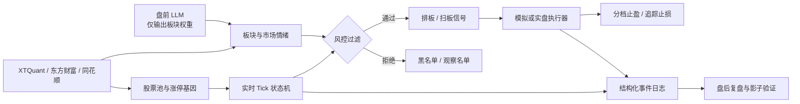

<p align="center">
  
</p>

# Limit-Up Sniper

[](https://github.com/guoyaohua/limit-up-sniper/actions/workflows/secret-scan.yml)
[](https://www.python.org/)
[](https://github.com/guoyaohua/limit-up-sniper#环境要求)
[](LICENSE)

**A股首板涨停打板策略自动化交易系统 v1.0**

> 一套面向中国 A 股市场的全自动化涨停板交易系统，融合量化选股、实时行情处理、多因子动态决策、LLM 板块预测、动态追踪止损等技术，实现从盘前分析到盘后复盘的全流程自动化。

> [!WARNING]
> 默认执行模式是 `simulation`。切换到 `live` 会发送真实委托；任何历史表现都
> 不代表未来收益，本项目不构成投资建议。

---

## 系统特性

- **涨停基因选股** — 基于 250 日历史数据的五因子加权评分模型，筛选封板能力最强的 1000 只股票
- **多进程实时处理** — 8 个 Tick 处理进程并行消费全市场行情，毫秒级响应涨停/炸板事件
- **多因子动态决策** — 综合市场情绪(1-10分)、板块效应、封单金额、资金流向、换手率等 10+ 因子
- **连续阈值插值** — 告别传统 if-else 阶梯函数，所有阈值随情绪评分连续平滑变化
- **LLM 盘前预测** — 接入通义千问/Azure OpenAI，分析同花顺热榜预测当日活跃板块
- **10 档动态追踪止损** — 以盘中最高价为锚点，盈利越高回撤容忍越小，非线性阶梯减仓
- **日内分档止盈** — 盈利 5%/8%/10% 逐步减仓各 25%
- **波动率仓位管理** — 振幅大的股票自动减仓，振幅小的自动加仓
- **换手率分级管控** — ≥25% 黑名单、15-25% 观察名单(减仓50%)、3-15% 正常
- **自动邮件报表** — 每 5 分钟发送 HTML 市场状态报表，异常即时告警
- **盘后智能复盘** — 自动计算每个过滤条件的精确率/召回率/F1，分析错过的机会
- **影子信号模式** — 实盘运行同时并行虚拟回测，对比策略变体表现
- **Tick 事件回测** — 下一笔行情成交、A 股成本/T+1/盘口容量、封板率与收益统一口径
- **Level2 数据支持** — 共享内存环形缓冲区 + 逐笔数据处理，微秒级延迟

---

## 策略架构



LLM 不直接决定买卖，只在经过结构校验后对候选板块的封单门槛提供有限折扣；
最终信号仍须同时通过股性、市场情绪、板块联动、资金流、换手率、封单与集中度检查。

---

## 项目结构

```
limit-up-sniper/
│
├── main.py                     # 主控入口
├── config.py                   # 全局配置中心
│
├── core/                       # 核心策略逻辑
│   ├── stock_pool.py           #   股票池初始化与过滤
│   ├── gene_calculator.py      #   涨停基因计算与强势股评分
│   ├── decisions.py            #   买入/撤单/卖出实时决策引擎
│   ├── trailing_stop.py        #   10 档动态追踪止损
│   ├── pre_market_sell.py      #   盘前卖出策略
│   └── interpolation.py        #   连续阈值插值函数
│
├── engine/                     # 执行引擎
│   ├── tick_processor.py       #   Tick 数据处理 & 状态机
│   ├── trader.py               #   实盘下单执行 (XTQuant)
│   ├── simulator.py            #   模拟交易器
│   ├── xt_callback.py          #   XTQuant 交易回调
│   └── xt_queries.py           #   持仓/委托/资产查询
│
├── data/                       # 数据管理
│   ├── shared_data.py          #   多进程共享数据初始化
│   ├── serialization.py        #   序列化/备份/恢复
│   ├── sector_mapping.py       #   板块-股票映射
│   └── helpers.py              #   数据转换工具
│
├── monitor/                    # 实时监控
│   ├── sector_monitor.py       #   板块涨幅 & 资金流向监控
│   ├── sentiment.py            #   市场情绪基础指标
│   ├── sentiment_task.py       #   情绪监控调度
│   ├── indicators.py           #   综合情绪评分 (1-10 分)
│   └── dashboard.py            #   HTML 邮件报表生成
│
├── analysis/                   # 分析模块
│   ├── pre_market_analysis.py  #   LLM 盘前板块预测 (U7)
│   ├── post_market_review.py   #   盘后策略复盘
│   └── review_daily.py         #   每日交易绩效报告
│
├── scraper/                    # 数据采集
│   ├── em_scraper_api.py       #   东方财富板块数据
│   ├── em_stock_capital_flow_scraper.py  # 个股资金流向
│   ├── dfcf_ztlb_parser.py     #   涨停/炸板页面解析
│   ├── tonghuashun_monitor.py  #   同花顺实时监控
│   ├── ths_sector_parser.py    #   同花顺板块分类解析
│   └── anti_ban_helper.py      #   反爬策略辅助
│
├── level2/                     # Level2 深度行情
│   ├── ARCHITECTURE.md         #   架构设计文档
│   ├── main.py                 #   L2 系统入口
│   ├── enums.py / models.py    #   枚举与数据模型
│   ├── buffers/                #   共享内存环形缓冲区
│   ├── calculators/            #   封单额/资金流计算引擎
│   └── consumers/              #   多进程消费者池
│
├── infra/                      # 基础设施
│   ├── common_enums.py         #   交易状态枚举定义
│   ├── task_manager.py         #   进程生命周期管理
│   ├── trade_log.py            #   交易日志持久化
│   ├── utils.py                #   邮件/日志工具
│   └── data_helpers.py         #   数据连接/价格工具
│
├── deps/                       # 外部依赖
│   └── ai_hotspot_trader/
│       ├── llm_client/         #   LLM 客户端 (DashScope/Azure/Copilot)
│       ├── ths_scraper/        #   同花顺爬虫核心
│       └── eastmoney_scraper/  #   东方财富爬虫核心
│
├── standalone/                 # 独立工具
├── test/                       # 单元测试
├── prompts/                    # LLM Prompt 模板
├── scripts/                    # 启动脚本
└── docs/                       # 详细文档
```

---

## 快速启动

### 环境要求

- Python 3.10+（CI 使用 3.11）
- Windows 操作系统（XTQuant/QMT 仅支持 Windows）
- QMT 量化交易客户端已安装并启动
- XTQuant 数据服务在线

### 安装依赖

```bash
python -m pip install -r requirements.txt
```

XTQuant SDK 需要从 QMT 客户端获取，不在 PyPI 上；缺少 SDK 时仍可运行不依赖
行情连接的离线单元测试。

### 配置

复制 `.env.example` 作为本机配置参考，并在系统或进程环境中设置所需变量。
项目不会从 `.env` 自动加载配置，也不要把真实账号或密钥写进代码、文档或提交。
PowerShell 示例：

```powershell
$env:LIMIT_UP_CLIENT_NAME = 'GJ_SIM'
$env:LIMIT_UP_EXECUTION_MODE = 'simulation'
$env:GJ_SIM_QMT_CLIENT_PATH = '<path-to-qmt-userdata-mini>'
$env:GJ_SIM_STOCK_ACCOUNT = '<account-id>'
```

邮件与可选 FTPS 报告发布分别使用 `SMTP_*` 和 `REPORT_FTP_*` 环境变量；
完整清单见 [`.env.example`](.env.example) 与 [配置手册](docs/configuration.md)。

真实委托需要显式设置 `LIMIT_UP_EXECUTION_MODE=live`，启动时仍需人工输入
`yes` 二次确认。日志只显示遮罩后的账号，客户端路径不回显。

### 运行

```bash
python main.py
```

或使用批处理脚本：

```bash
scripts\run_strategy.bat
```

### 影子交易与 Tick 回测

设置 `LIMIT_UP_ENABLE_SHADOW_SIGNAL=true` 后，实盘行情会同时驱动独立的持久化
纸面账户；虚拟成交、持仓市值、浮动盈亏和净值曲线不会向 QMT 发送委托。

```powershell
# 在 QMT Python 环境保存可重放的完整 Tick/五档盘口
python scripts/capture_ticks.py --verify

# 使用策略插件回测；默认信号在下一笔该股票 Tick 成交，防止前视
python scripts/run_backtest.py --ticks output/tick_archive/20260710 `
  --strategy path/to/strategy.py --output output/backtests/20260710.json
```

归档、插件接口、成交假设和指标口径见 [Tick 回测与影子交易](docs/backtesting.md)。

---

## 交易日流程

```
  启动 (~9:00)    盘前 (9:15)    开盘 (9:30)           尾盘 (14:50)    收盘 (15:00)
  ──┬───────────┬────────────┬─────────────────────────┬──────────────┬──
    │           │            │                         │              │
    │ 初始化     │ LLM 预测   │   实时 Tick 处理         │ 14:50 清仓   │ 数据保存
    │ 股票池     │ 板块优先级  │   买入/撤单/卖出决策      │ 14:55 撤单   │ 盘后复盘
    │ 基因计算   │ 盘前挂单    │   板块/情绪监控           │              │ 邮件报告
    │ 数据加载   │            │   止盈止损管理            │              │
```

**详细流程请查阅**: [docs/trading-flow.md](docs/trading-flow.md)

---

## 核心策略概述

### 买入决策

系统支持两种买入模式：

| 模式 | 条件 | 适用场景 |
|------|------|---------|
| **排板** | 股价已涨停，封单金额达标 | 封死涨停的强势股 |
| **扫板** | 股价接近涨停，市场极强 | 即将封板的活跃股 |

约 **10 个前置条件**必须全部通过才会触发买入，包括：
- 市场情绪评分 ≥ 2.5（极弱市不买）
- 在涨停基因 Top 1000 中
- 换手率 3%-25% 区间
- 板块效应存在且不超过集中度限制
- 个股资金流入信号存在
- 封单金额 ≥ 动态阈值（由情绪评分插值计算）

### 卖出策略

```
优先级从高到低:
├── 14:50 尾盘清仓 → 市价全卖
├── 跌停触发       → 跌停价全卖
├── 接近涨停       → 市价全卖（锁利）
├── 日内止盈       → 5%/8%/10% 各卖 25%
└── 追踪止损       → 10 档阶梯减仓
```

### 市场情绪评分

综合涨停数、炸板率、昨日延续率、大盘指数等 6 项因子，计算 **1-10 分**情绪评分。评分直接驱动：
- 封单金额门槛（高情绪 → 低门槛）
- 是否允许扫板（≥ 4 分）
- 板块/领涨要求数量
- 是否停止买入（< 2.5 分）

---

## 文档中心

完整文档位于 [docs/](docs/) 目录：

| 文档 | 说明 |
|------|------|
| [文档索引](docs/index.md) | 文档导航与阅读指引 |
| [系统架构总览](docs/architecture.md) | 整体架构、模块关系、多进程模型、设计决策 |
| [每日交易流程](docs/trading-flow.md) | 完整交易日流程（从启动到收盘每一步） |
| [配置参数手册](docs/configuration.md) | 所有参数详解与调优建议 |
| [核心策略模块](docs/core-strategy.md) | 买入/卖出/撤单决策逻辑、涨停基因、止盈止损 |
| [执行引擎](docs/engine.md) | Tick 处理、实盘下单、模拟交易、回调机制 |
| [Tick 回测与影子交易](docs/backtesting.md) | Tick 归档、纸面撮合、回测插件与指标口径 |
| [数据管理](docs/data-management.md) | 共享数据结构、序列化/备份、板块映射 |
| [监控体系](docs/monitoring.md) | 板块监控、情绪评分、指标计算、邮件报表 |
| [分析模块](docs/analysis.md) | 盘前 LLM 预测、盘后复盘、绩效分析 |
| [数据采集](docs/scraper.md) | 东方财富/同花顺数据抓取、反爬策略 |
| [Level2 行情](docs/level2.md) | Level2 逐笔数据处理架构与实现 |
| [基础设施](docs/infrastructure.md) | 进程管理、枚举定义、日志与邮件 |
| [策略升级与验证计划](docs/strategy-upgrade-2026-07-12.md) | 本轮策略修复、盘前扩容、影子/回测闭环与 A/B 上线门槛 |
| [迁移策略复盘](docs/strategy-review-2025-12-23_2026-01-12.md) | 旧项目 12 日报告聚合、保护清单与改进证据 |

**推荐阅读顺序**：架构总览 → 交易流程 → 核心策略 → 配置参数

---

## 技术栈

| 组件 | 技术 |
|------|------|
| 语言 | Python 3.10+（CI 使用 3.11） |
| 交易接口 | XTQuant (QMT 量化交易) |
| 数据源 | XTQuant、东方财富 API、同花顺爬虫、akshare |
| LLM | DashScope (通义千问)、Azure OpenAI、Copilot Vision |
| 进程模型 | multiprocessing 多进程 + Manager 共享数据 |
| Level2 缓冲区 | 共享内存 + msgpack 序列化 |
| 日志 | loguru (5 级分文件) |
| 邮件 | SMTP (QQ 邮箱 SSL) |
| 数据处理 | pandas, numpy |
| 任务调度 | schedule, 自定义 TaskManager |

---

## 版本演进

| 版本 | 主要更新 |
|------|---------|
| v2.3 | 涨停基因计算向量化优化 |
| v2.4 | 任务管理器 + 心跳监控 + 影子信号模式 + Manager 并行初始化优化 |
| v3.0 | 动态追踪止损 + 日内分档止盈 + 波动率仓位管理 |
| U5 | 换手率三级处理机制 |
| U6 | 波动率加权仓位管理 (VOLATILITY_TARGET) |
| U7 | LLM 盘前板块优先级预测 + 封单阈值折扣 |
| U8 | 交易日志结构化记录 |
| v1.0 | 新仓库首个正式版本（整合此前 v2/v3/U5-U8 全部特性） |

---

## 测试

```bash
# 全部离线测试（外部集成测试默认跳过）
python -m pytest -q

# 涨停基因计算一致性测试
python -m pytest test/test_calculate_stock_gene_consistency.py

# 追踪止损计算测试
python -m pytest test/test_calculate_trailing_stop_prices.py

# 共享数据序列化测试
python -m pytest test/test_save_load.py

# 板块监控测试
python -m pytest test/test_sector_monitor.py
```

默认套件只收集可离线运行的回归测试。需要 QMT、网络、浏览器或本地行情文件
的脚本应单独指定路径运行，并显式设置 `RUN_INTEGRATION_TESTS=true`。

---

## 输出文件

| 目录 | 内容 |
|------|------|
| `output/强势股票/` | 涨停基因 Top 1000 股票 CSV |
| `output/涨停列表/` | 每日涨停/首板/炸板列表 |
| `output/trade_logs/` | 交易日志 (JSON) |
| `output/tick_archive/` | 按交易日分段的 gzip Tick 归档与完整性 manifest |
| `output/paper_trading/` | 模拟/影子账户 SQLite 账本与净值曲线 |
| `output/backtests/` | 回测 JSON 结果 |
| `output/concept_sectors/` | 概念板块映射 |
| `output/industry_sectors/` | 行业板块映射 |
| `log/` | 分级日志文件 (DEBUG/INFO/WARNING/ERROR/CRITICAL) |

---

## 风险提示

本系统仅供量化交易研究与学习使用。股票投资有风险，自动化交易可能导致快速亏损。请在充分了解风险的前提下使用，并始终以 `LIMIT_UP_EXECUTION_MODE=simulation` 进行充分测试后再考虑实盘运行。

## 参与贡献

欢迎提交 Bug、策略改进和工程优化。策略变更应提供清晰的指标口径、数据区间、
交易成本假设和样本外验证结果，并说明如何排除未来函数与幸存者偏差。完整流程见
[CONTRIBUTING.md](CONTRIBUTING.md)；安全问题请按 [SECURITY.md](SECURITY.md) 私下报告。

## 安全与许可

账号、路径、API key、SMTP/FTP 凭据和抓取会话令牌全部通过环境变量传入。
提交前运行 `python scripts/scan_secrets.py`，并用 gitleaks 扫描完整历史；发现泄露后应先轮换
凭据，再清理历史。安全报告方式见 [SECURITY.md](SECURITY.md)。项目采用
[MIT License](LICENSE)。
