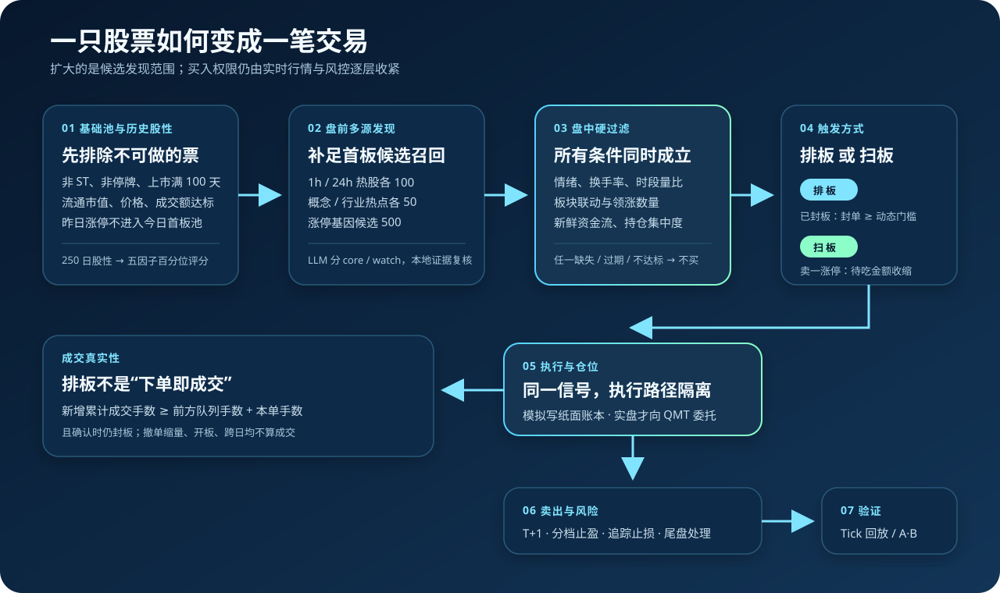
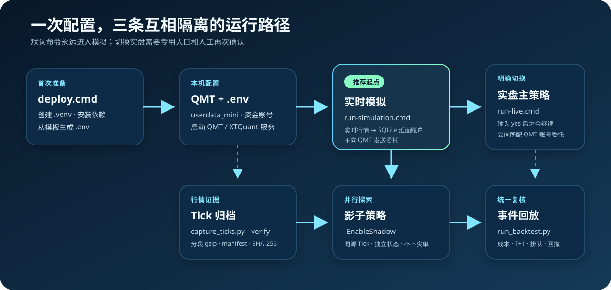

<p align="center">
  
</p>

<h1 align="center">Limit-Up Sniper</h1>

<p align="center">
  A 股首板候选发现、实时决策、模拟/实盘执行与 Tick 回放研究系统
</p>

<p align="center">
  <a href="https://github.com/guoyaohua/limit-up-sniper/actions/workflows/secret-scan.yml"></a>
  <a href="https://www.python.org/"></a>
  
  <a href="LICENSE"></a>
</p>

Limit-Up Sniper 的核心思路是：先从全市场筛出历史股性较好的首板候选，再用实时
情绪、板块联动、资金流、换手率、量能和盘口做逐层确认，最后选择“排板”或
“扫板”。LLM 只帮助盘前扩大候选发现，不直接决定买卖。

默认运行模式是 `simulation`，使用真实 XTQuant 行情驱动持久化纸面账户，
不会向 QMT 发送委托。只有显式运行实盘入口并输入 `yes` 后，主策略才可能发出
真实委托。

> [!WARNING]
> 本项目是量化研究与工程框架，不是收益承诺或投资建议。现有迁移数据只有 12 个
> 交易日，且缺少完整买卖配对与连续净值，尚不能证明本轮升级提高了封板率或收益率。

## 先看懂策略

<p align="center">
  
</p>

### 1. 基础股票池：先排除不可做的股票

启动后从沪深 A 股构建基础池，排除科创板、北交所、ST、停牌、上市不足 100 天
和关键行情字段缺失的股票。随后使用最近日线继续过滤低流通市值、低价格、低成交额、
涨停价仍在 60 日均线下方，以及昨日已经涨停的股票。昨日涨停只用于判断题材延续或
退潮，不再混入“今日首板”候选。

### 2. 涨停基因：历史上什么样的票更容易封住并给溢价

系统对最近 250 个交易日计算五项正向因子，再将各因子转成横截面百分位。
三项比例因子使用 Wilson 95% 下界排序，平均溢价向全市场均值做小样本收缩，
避免 `1/1=100%` 的偶然记录压过大样本、可复现的历史表现：

| 因子 | 权重 | 想回答的问题 |
|---|---:|---|
| 涨停次日收盘溢价超过 5% 的比例 | 25% | 封板后是否常有强溢价 |
| 首板次日收盘红盘率 | 25% | 首板次日是否容易维持正收益 |
| 首板封板率 | 25% | 触板后是否容易封住 |
| 首板涨停/炸板后的次日开盘平均溢价 | 15% | 次日是否有可兑现空间 |
| 近 250 日涨停次数 | 10% | 股性是否活跃 |

还会排除首板封板有效样本少于 3 次或原始封板率不高于 70%、近一年没有涨停、历史涨停后开盘和收盘平均
溢价均低于 1% 的股票，最后按综合分降序保留最多 1000 只。所有“次日”统计只在
结果已经可见后进入特征，避免把未来数据泄漏进当日选股。

### 3. 盘前扩容：提高首板召回，但不放宽买入权限

盘前模块合并 1 小时热股 100 只、24 小时热股 100 只、概念/行业热点各 50 个，
以及涨停基因候选 500 只。Prompt 同时寻找延续主线、轮动支线和新发酵题材，最多
输出 30 只候选：

- `core`：置信度至少 0.78，并且有至少两类本地证据；
- `watch`：证据较弱或只有单一来源，仅用于继续观察。

模型输出会经过本地股票代码、板块映射和证据来源复核，不能凭空创造候选。模拟模式
可以直接测量扩展候选；实盘主策略仍使用原核心池，扩展候选只进入独立影子通道。

### 4. 盘中确认：以下硬条件必须同时通过

| 过滤层 | 当前规则 | 不通过时 |
|---|---|---|
| 交易时点 | 14:50 后不再新买；首次触板达到或晚于 14:30 不买 | 跳过 |
| 候选资格 | 必须属于当前通道的强势股票池 | 跳过 |
| 市场情绪 | 评分低于 2.5 | 停止买入 |
| 个股状态 | 已持仓、已有有效委托或进入黑名单 | 跳过 |
| 换手率 | 低于 3% | 跳过 |
| 换手率 | 15%–25% | 进入观察名单，仓位减半 |
| 换手率 | 不低于 25% | 当日黑名单 |
| 时段量比 | 按连续竞价已交易分钟归一化后低于 0.7 | 跳过 |
| 板块效应 | 没有有效概念/行业联动，或数据超过 60 秒 | 跳过 |
| 资金流 | 没有个股流入信号，或数据超过 180 秒 | 跳过 |
| 集中度 | 任一概念已持有 2 只 | 跳过 |

这里采用 fail-closed：关键实时数据缺失或过期时不买，而不是沿用旧信号。市场情绪
由涨停数量、炸板率、昨日延续与表现、四大指数及指数分化综合成 1–10 分。

### 5. 两种入场：排板与扫板

| 入场方式 | 触发盘口 | 额外条件 |
|---|---|---|
| 排板 | 最新价和买一价均等于涨停价、卖一为空，盘口确认封板 | 封单金额达到情绪动态门槛；弱市要求更多板块与领涨共振；当日总撤单次数不超过 25 |
| 扫板 | 尚未封板，但卖一价已经等于涨停价 | 情绪至少 4 分；吃到涨停价所需可见卖盘资金不高于 300 万且较前一 Tick 缩小；价格不能转弱；板块与领涨数达标 |

排板的基础封单门槛随情绪连续变化：

| 情绪分 | 10 | 8 | 7 | 5.5 | 4 | 2.5 |
|---:|---:|---:|---:|---:|---:|---:|
| 封单门槛 | 2000 万 | 3000 万 | 5000 万 | 8000 万 | 1 亿 | 1.5 亿 |

盘前 LLM 命中的优先板块最多把门槛降低 30%，但最低仍受 2000 万绝对门槛约束，
并且不能绕过任何盘中硬过滤。

### 6. 成交不是假设：排板必须真的穿过队列

模拟、影子和事件回放不会把“发出排板委托”直接记成盈利成交。只有满足：

$$
	ext{下单后新增累计成交手数} \geq
	ext{下单时前方队列手数} + 	ext{本单手数}
$$

并且确认 Tick 仍处于封板状态，才确认整单成交。封单减少可能只是撤单，因此不算
成交；开板、主动撤单或跨交易日会让原排队位置永久失效。这个模型有意偏保守。

扫板和普通纸面成交使用下一笔该股票 Tick、可见五档盘口 VWAP、盘口参与率、
滑点、佣金、最低佣金、印花税、过户费、100 股整手及 T+1 约束。

### 7. 仓位、撤单与卖出

- 单股基准金额为总资产的六分之一；近 20 日振幅相对 5% 目标越大，仓位越小，
  调整倍数限制在 0.5–1.5；观察名单再乘 0.5。
- 排板开板、封单低于 2000 万、封单骤降后低于情绪门槛、换手率达到 25%、
  资金流消失或尾盘仍未成交时撤买单。
- 实盘启动时先处理隔夜持仓；默认昨日涨停持仓按昨收上方 2% 限价挂卖，
  非昨日涨停持仓若昨收跌破成本 5% 则盘前止损。
- 盘中盈利达到 5% / 8% / 10% 时各减 25%；其余仓位使用以盘中最高价为锚的
  10 档追踪止损。盈利越多，允许回撤从 5% 逐步收紧到 2.5%。
- 14:50 后尝试按可用持仓和可见买盘深度卖出。A 股跌停或流动性不足时，
  委托不保证成交。

更细的判断顺序见[核心策略说明](docs/core-strategy.md)与[每日交易流程](docs/trading-flow.md)。

## 一键部署与运行

<p align="center">
  
</p>

### 前置条件

- Windows 10/11 与 PowerShell 5.1+；
- Python 3.10 或更高版本；
- 已安装并启动支持 XTQuant 的 QMT 客户端；
- QMT 的 `userdata_mini` 路径和资金账号。即使只做实时模拟，也需要 QMT 行情连接。

XTQuant 由 QMT 提供，不在 PyPI。启动器会尝试从常见 QMT 目录定位它；若未找到，
请在 `.env` 中把 `XTQUANT_PYTHONPATH` 指向包含 `xtquant` 文件夹的
`site-packages` 目录。

### 第一次：双击部署

克隆仓库后双击 `scripts\deploy.cmd`，或在仓库根目录运行：

```powershell
.\scripts\deploy.cmd
```

它会创建 `.venv`、安装依赖，并在不存在时从 `.env.example` 生成 `.env`。然后只需
编辑 `.env` 中与所选客户端对应的三项：

```dotenv
LIMIT_UP_CLIENT_NAME=GJ_SIM
GJ_SIM_QMT_CLIENT_PATH=C:\path\to\userdata_mini
GJ_SIM_STOCK_ACCOUNT=your-account-id
```

如果使用实盘客户端，将 `LIMIT_UP_CLIENT_NAME` 改为 `CICC_LIVE`，并填写
`CICC_QMT_CLIENT_PATH`、`CICC_STOCK_ACCOUNT`。`.env` 已被 Git 忽略，不要把真实
账号、路径或密钥提交到仓库。

全新仓库还没有运行期板块映射。第一次启动请运行
`.\scripts\run-simulation.cmd -RefreshSector`；该步骤可能打开 Edge，需要登录问财，
抓取完成后会生成概念/行业映射。启动器还会检查上一交易日的涨停与首板清单。
已有文件绝不覆盖；首次接入缺少文件时会从公开行情源生成；获取到空数据或字段异常时
会安全终止。正常连续运行也会在每天收盘生成下一交易日所需清单。

### 每天：双击实时模拟

推荐先连续运行至少 20 个交易日：

```powershell
.\scripts\run-simulation.cmd
```

这是安全默认入口。即使 `.env` 中误写了 `LIMIT_UP_EXECUTION_MODE=live`，该脚本也会
强制覆盖为 `simulation`。它会复用实时行情与完整策略，但订单只进入
`output/paper_trading/simulation.sqlite3`。首次运行或依赖变化时会自动部署。

开启扩展候选影子通道：

```powershell
.\scripts\run-simulation.cmd -EnableShadow
```

首次运行或需要更新时，刷新问财板块映射并运行：

```powershell
.\scripts\run-simulation.cmd -RefreshSector
```

只做环境、账号路径、XTQuant、板块映射和上一交易日清单检查，不启动策略：

```powershell
.\scripts\run-simulation.cmd -PreflightOnly
```

### 实盘：使用独立入口

确认模拟结果、成本假设和风控都符合预期后，才运行：

```powershell
.\scripts\run-live.cmd
```

脚本会显式设置 `live`，随后 `main.py` 还会要求输入小写 `yes`。在输入前请再次核对
QMT 客户端、遮罩账号、策略版本和运行模式。开启影子对照可使用：

```powershell
.\scripts\run-live.cmd -EnableShadow
```

此时只有主策略发 QMT 委托；影子策略使用同一份实时 Tick 和独立纸面账户，不发实单。

### PowerShell 完整入口

需要组合参数时可直接调用：

```powershell
# 安装开发测试依赖
.\scripts\setup.ps1 -Dev

# 默认仍为 simulation
.\scripts\run.ps1

# 显式实盘 + 影子 + 刷新板块映射
.\scripts\run.ps1 -Mode live -EnableShadow -RefreshSector
```

## Tick 保存、影子收益与回测

### 保存每日完整 Tick

在 QMT/XTQuant 服务在线时运行：

```powershell
.\.venv\Scripts\python.exe scripts\capture_ticks.py --verify
```

归档按交易日写入 `output/tick_archive/YYYYMMDD/`，保留五档盘口、事件时间、接收时间、
回调批次和股票代码，并用 manifest 与 SHA-256 校验。空归档、队列丢包、后台写盘错误、
记录数或顺序异常都会 fail closed，不能静默进入严谨回测。

### 回放真实主策略或影子决策

```powershell
.\.venv\Scripts\python.exe scripts\run_backtest.py `
  --ticks output/tick_archive/20260710 `
  --events output/trade_logs/20260710/events.jsonl `
  --event-source primary `
  --event-buy-target-value 100000 `
  --output output/backtests/primary-20260710.json
```

将 `--event-source` 改为 `shadow` 可评估影子信号。旧事件若没有 `signal_source` 会默认
拒绝；只有明确接受来源歧义时才加入 `--accept-legacy-unlabelled-events`。

回测会输出扣费收益、最大回撤、胜率、Profit Factor、净值曲线、收盘封板率、
排板未成交与队列失效等指标。默认下一笔同股 Tick 才允许成交，避免同 Tick 前视。
也可以使用自定义策略插件；接口与全部参数见[Tick 回测与影子交易](docs/backtesting.md)。

## 三种模式的边界

| 模式 | 行情 | 策略/账户 | 会发真实委托吗 |
|---|---|---|---|
| 实时模拟 | 实时 XTQuant | 主策略 + 持久化纸面账户 | 否 |
| 实盘 + 可选影子 | 实时 XTQuant | 主策略发 QMT；影子状态与纸面账户独立 | 仅主策略 |
| 离线 Tick 回测 | 已校验归档 | 回放实例 + 内存纸面账户 | 否 |

事件回放验证的是“当时已记录的决策在统一撮合口径下会怎样成交”，还不是把整套实时
策略放到历史 Tick 上重新决策。后者仍需把代码中的系统时钟统一改成事件时钟。

## 输出在哪里

| 路径 | 内容 |
|---|---|
| `output/涨停基因/` | 每日全量涨停基因指标 |
| `output/强势股票/` | 过滤与排序后的 Top 1000 候选 |
| `output/涨停列表/` | 当日涨停、首板与炸板记录 |
| `output/trade_logs/` | 带 `primary` / `shadow` 来源的结构化策略事件 |
| `output/paper_trading/` | `simulation.sqlite3` 与 `shadow.sqlite3` 账本、成交和净值 |
| `output/tick_archive/` | 分段 gzip Tick、manifest 与摘要 |
| `output/backtests/` | 回测 JSON 结果 |
| `logs/` | 分级运行日志 |

## 如何判断升级真的有效

不要只看“后来涨停了多少只”。至少连续采集 20 个交易日，并让核心池 A 组与
扩展影子池 B 组使用相同 Tick、参数、成本和撮合规则。验证窗口开始后冻结参数，至少比较：

- 可成交信号数、未成交率、排板队列失效与撤单比例；
- 收盘封板率及 Wilson 95% 区间、次日开盘/收盘收益；
- 扣费净收益、胜率及区间、平均单笔收益、Profit Factor；
- 最大回撤、最大单笔亏损和板块集中度；
- 提高费用/滑点、降低盘口参与率后的敏感性。

扩展池只有在扣费收益和封板质量不退化、风险不越界、改善不集中于单只股票或单一
市场阶段时，才适合考虑小规模晋级。完整口径见
[策略升级与验证计划](docs/strategy-upgrade-2026-07-12.md)。

## 项目结构

```text
limit-up-sniper/
├── main.py                 # 交易日主入口与进程编排
├── config.py               # 模式、账户和策略参数
├── analysis/               # 盘前 LLM 发现、盘后复盘
├── core/                   # 股票池、涨停基因、买卖/撤单、追踪止损
├── engine/                 # Tick 状态机、实盘/模拟执行、回测与事件回放
├── data/                   # 共享数据、序列化、Tick 归档
├── monitor/                # 市场情绪、板块联动与监控报表
├── scraper/                # 东方财富、同花顺数据采集
├── level2/                 # Level2 研究组件
├── prompts/                # 盘前首板发现 Prompt
├── scripts/                # 一键部署/运行、Tick 采集、回测工具
├── test/                   # 离线回归测试
└── docs/                   # 详细设计、配置和研究口径
```

## 文档导航

| 文档 | 适合什么时候看 |
|---|---|
| [文档索引](docs/index.md) | 不确定从哪里开始 |
| [系统架构](docs/architecture.md) | 理解进程、模块与数据流 |
| [每日交易流程](docs/trading-flow.md) | 按时间理解一天如何运行 |
| [核心策略](docs/core-strategy.md) | 查看买入、撤单、卖出细节 |
| [配置手册](docs/configuration.md) | 修改模式、账户、仓位和阈值 |
| [执行引擎](docs/engine.md) | 理解 Tick 状态机与委托执行 |
| [Tick 回测与影子交易](docs/backtesting.md) | 保存行情、模拟收益、事件回放 |
| [策略升级与验证计划](docs/strategy-upgrade-2026-07-12.md) | 查看已修复问题与 A/B 验收边界 |

## 测试与安全检查

不安装 QMT/XTQuant 也可运行默认离线回归测试：

```powershell
python -m pip install -r requirements-dev.txt
python -m pytest -q
python scripts\scan_secrets.py
```

需要 QMT、网络、浏览器、凭据或本地行情文件的集成脚本不在默认 pytest 集合中。
GitHub Actions 会在干净的 Python 3.11 Windows 环境运行离线测试，并单独用 gitleaks
扫描可达 Git 历史。

## 风险与许可

自动化交易可能在很短时间内产生显著亏损，涨停排队、行情延迟、跌停流动性和实盘
滑点都无法被历史回测完全复现。请从实时模拟开始，核对每一笔决策、排队证据、成交、
费用和净值，再决定是否承担实盘风险。

参与贡献前请阅读 [CONTRIBUTING.md](CONTRIBUTING.md)。安全问题请按
[SECURITY.md](SECURITY.md) 私下报告。项目采用 [MIT License](LICENSE)。
