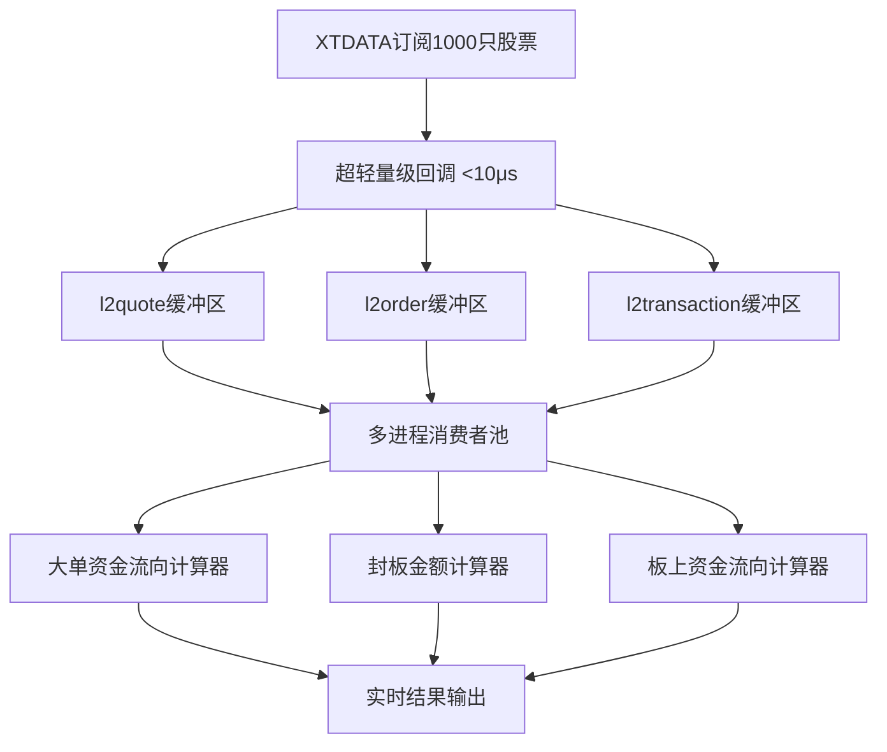

# A股 Level 2 数据实时接收处理系统 - 架构设计文档

## 项目概述

### 核心目标
开发一套 A 股 Level 2 数据实时接收与处理脚本，满足高并发、海量数据（亿级）处理性能要求，精准区分沪深两市 Level 2 数据差异，并完成指定的实时量化计算。

### 三大核心需求

```
┌─────────────────────────────────────────────────────────────────────┐
│                        三大核心计算需求                                │
├─────────────────────────────────────────────────────────────────────┤
│                                                                     │
│  需求1️⃣：全量股票大单资金流向计算                                     │
│  ├─ 超大单定义：成交量≥50万股 或 成交金额≥100万元                     │
│  ├─ 大单定义：10万股≤成交量<50万股 或 20万元≤成交金额<100万元          │
│  ├─ 统计维度：超大单买入/卖出、大单买入/卖出                           │
│  └─ 适用范围：全部订阅股票，全交易时段                                 │
│                                                                     │
│  需求2️⃣：涨停股票实时封板金额计算                                     │
│  ├─ 封板金额 = 涨停价位未成交买单金额总和                              │
│  ├─ 预警条件：封板金额 < 2000万元 → 打印 CRITICAL 日志                │
│  ├─ 实时更新：结合逐笔委托、逐笔成交动态计算                           │
│  └─ 适用范围：涨停状态的股票                                          │
│                                                                     │
│  需求3️⃣：涨停板上大资金流向计算                                       │
│  ├─ 计算逻辑：与需求1相同，仅统计涨停期间的成交                        │
│  ├─ 时间范围：[首次涨停, 炸板] ∪ [回封, 再炸板] ...                  │
│  └─ 可与需求1合并实现（增加涨停状态判断）                              │
│                                                                     │
└─────────────────────────────────────────────────────────────────────┘
```

---

## 第一章：需求拆解与实现路径

### 1.1 需求拆解矩阵

| 需求 | 依赖数据源 | 核心挑战 | 解决方案 |
|-----|-----------|---------|---------|
| **全量大单资金流向** | l2order + l2transaction | 1. 大单被拆分成多笔小成交<br>2. 主动买卖方向判定 | 基于委托追踪的资金流向计算 |
| **涨停封板金额** | l2quote + l2order + l2transaction | 1. 实时性要求高<br>2. 需处理撤单和成交消耗 | 混合计算方案（快照基线+增量追踪） |
| **板上大资金流向** | l2transaction + 涨停状态 | 需精确判定涨停时段 | 复用需求1，增加涨停状态过滤 |

### 1.2 性能核心矛盾

```
┌─────────────────────────────────────────────────────────────────────┐
│                      性能核心矛盾分析                                  │
├─────────────────────────────────────────────────────────────────────┤
│                                                                     │
│  【问题】Level 2 数据量级 = 亿级/天                                   │
│                                                                     │
│  典型场景：                                                          │
│  ├─ 1000只股票 × 2市场                                               │
│  ├─ 深交所：实时推送，约 10万笔/分钟                                   │
│  ├─ 上交所：3秒打包推送，连续竞价约 5-8万笔/分钟                        │
│  └─ **峰值：9:25集合竞价结束，上交所集中推送 50-100万笔**              │
│                                                                     │
│  【矛盾】                                                            │
│  数据生产速度（2500-3000笔/秒，峰值10万笔/秒）                         │
│       vs                                                            │
│  回调函数阻塞（任何延迟都会导致数据积压甚至丢失）                       │
│                                                                     │
│  【解决思路】                                                        │
│  回调函数必须 < 10μs（超轻量级）+ 多进程并行消费                       │
│                                                                     │
└─────────────────────────────────────────────────────────────────────┘
```

### 1.3 实现路径总览



---

## 第二章：XTDATA 订阅与回调设计

### 2.1 XTDATA 订阅 API（正确用法）

```python
import xtdata
from functools import partial

TODAY = '20251206'  # 当日日期

# 准备回调函数
def on_l2quote(datas):
    """l2quote回调：datas = {stock_code: quote_dict}"""
    # 超轻量级处理：直接写入共享内存
    pass

def on_l2order(datas):
    """l2order回调：datas = {stock_code: order_dict}"""
    pass

def on_l2transaction(datas):
    """l2transaction回调：datas = {stock_code: trans_dict}"""
    pass

# 订阅股票列表
stock_list = ['600000.SH', '000001.SZ', ...]  # 约1000只股票

# === 正确的订阅方式 ===

# 1. 订阅 Level2 行情快照（l2quote）
subscribe_id_quote = xtdata.subscribe_quote(
    stock_list,
    period='l2quote',
    start_time=TODAY + '000000',
    count=0,
    callback=on_l2quote
)

# 2. 订阅逐笔委托（l2order）
subscribe_id_order = xtdata.subscribe_quote(
    stock_list,
    period='l2order',
    start_time=TODAY + '000000',
    count=0,
    callback=on_l2order
)

# 3. 订阅逐笔成交（l2transaction）
subscribe_id_trans = xtdata.subscribe_quote(
    stock_list,
    period='l2transaction',
    start_time=TODAY + '000000',
    count=0,
    callback=on_l2transaction
)

# 4. 启动事件循环（阻塞调用，建议在独立线程中运行）
# xtdata.run()
```

### 2.2 回调函数性能优化（最高优先级）

#### 核心原则：回调函数必须 < 10μs

```python
# ❌ 错误示例：回调中做复杂计算
def on_l2order_bad(datas):
    for code, order in datas.items():
        # JSON序列化 - 耗时 5-20μs
        json_str = json.dumps(order)
        # 计算大单类型 - 耗时 10μs
        if order['volume'] >= 100000:
            classify_large_order(order)
        # 总耗时 > 30μs，会严重阻塞！

# ✅ 正确示例：超轻量级回调
def on_l2order_good(datas):
    for code, order in datas.items():
        # 方案1：msgpack打包（比JSON快5-10倍）
        packed = msgpack.packb((code, order), use_bin_type=True)
        shared_buffer.put(packed)  # 共享内存写入 < 2μs
        # 总耗时 < 5μs ✓
```

#### 性能方案对比

| 方案 | 单次延迟 | 适用场景 | 优缺点 |
|-----|---------|---------|-------|
| **共享内存 + msgpack** | 2-5μs | 高频海量数据 | ✅ 最快<br>⚠️ 需预分配空间 |
| multiprocessing.Queue | 10-50μs | 通用场景 | ✅ 易用<br>❌ pickle开销大 |
| Redis/ZMQ | 100-500μs | 分布式 | ❌ 网络延迟高 |

**推荐方案：共享内存环形缓冲区 + msgpack序列化**

### 2.3 共享内存缓冲区容量规划

```python
"""
容量估算公式：

缓冲区槽位数 = 峰值数据量 × 安全系数

【峰值数据量计算】
- 上交所9:25集合竞价集中推送：50-100万笔
- 连续竞价峰值：3000笔/秒 × 10秒缓冲 = 3万笔
- 建议配置：

l2quote缓冲区：10万槽位（快照3秒推送一次，量小）
l2order缓冲区：150万槽位（应对9:25峰值 + 50%安全边际）
l2transaction缓冲区：50万槽位（成交量相对较小）
"""

from shared_memory_ring_buffer import SharedMemoryRingBuffer

# 创建缓冲区
l2quote_buffer = SharedMemoryRingBuffer(
    name="l2quote",
    slot_count=100_000,
    slot_data_size=1024  # 每条快照约1KB
)

l2order_buffer = SharedMemoryRingBuffer(
    name="l2order",
    slot_count=1_500_000,  # 150万槽位
    slot_data_size=256     # 每条委托约256字节
)

l2transaction_buffer = SharedMemoryRingBuffer(
    name="l2transaction",
    slot_count=500_000,
    slot_data_size=256
)
```

### 2.4 缓冲区溢出处理策略

| 策略 | 实现方式 | 优缺点 |
|-----|---------|-------|
| ❌ 阻塞等待 | 缓冲区满时回调阻塞 | 会导致更严重的数据丢失 |
| ⚠️ 丢弃新数据 | 满时拒绝写入 | 丢失最新数据，影响实时性 |
| ✅ **覆盖旧数据（推荐）** | 环形覆盖 + 溢出计数 | 保留最新数据，记录溢出统计 |

```python
class SafeRingBuffer:
    """带溢出保护的环形缓冲区"""
    
    def put(self, data):
        """写入数据，允许覆盖"""
        if self.is_full():
            self.overflow_count += 1
            logger.warning(f"缓冲区溢出！累计: {self.overflow_count}")
        
        self.buffer.put(data)  # 覆盖最旧数据
```

---

## 第三章：沪深两市差异处理

### 3.1 核心差异汇总

```
┌─────────────────────────────────────────────────────────────────────┐
│                     沪深两市 Level2 数据差异                          │
├─────────────────────────────────────────────────────────────────────┤
│                                                                     │
│  【推送机制差异】                                                     │
│  ├─ 上交所：3秒打包推送；9:25集合竞价后集中推送                        │
│  └─ 深交所：实时推送（约0.01秒）                                      │
│                                                                     │
│  【委托完整性差异】                                                   │
│  ├─ 上交所：可能省略已全成交的委托（"成交优先"原则）                   │
│  └─ 深交所：完整推送所有委托                                          │
│                                                                     │
│  【撤单标识差异】⭐ 最关键                                            │
│  ├─ 上交所：在 l2order.entrustDirection 字段                         │
│  │   ├─ entrustDirection=1 → 买入                                   │
│  │   ├─ entrustDirection=2 → 卖出                                   │
│  │   ├─ entrustDirection=3 → 撤买 ⭐                                │
│  │   └─ entrustDirection=4 → 撤卖 ⭐                                │
│  │                                                                  │
│  └─ 深交所：在 l2transaction.tradeFlag 字段                          │
│      ├─ tradeFlag=1 → 外盘（主动买入）                               │
│      ├─ tradeFlag=2 → 内盘（主动卖出）                               │
│      └─ tradeFlag=3 → 撤单 ⭐                                        │
│                                                                     │
└─────────────────────────────────────────────────────────────────────┘
```

### 3.2 市场判定与路由

```python
def get_market(stock_code: str) -> str:
    """根据股票代码判定市场"""
    if stock_code.endswith('.SH'):
        return 'SH'  # 上交所
    elif stock_code.endswith('.SZ'):
        return 'SZ'  # 深交所
    else:
        raise ValueError(f"Unknown market: {stock_code}")

def is_cancel_order(stock_code: str, order_data: dict, trans_data: dict = None) -> bool:
    """
    判断是否为撤单
    
    Args:
        stock_code: 股票代码
        order_data: l2order数据（可选）
        trans_data: l2transaction数据（可选）
    """
    market = get_market(stock_code)
    
    if market == 'SH' and order_data:
        # 上交所：检查委托方向
        direction = int(order_data.get('entrustDirection', 0))
        return direction in (3, 4)  # 3=撤买, 4=撤卖
    
    elif market == 'SZ' and trans_data:
        # 深交所：检查成交标志
        trade_flag = int(trans_data.get('tradeFlag', 0))
        return trade_flag == 3  # 3=撤单
    
    return False
```

---

## 第四章：三大核心计算实现

### 4.1 需求1：全量股票大单资金流向计算

#### 4.1.1 核心问题：大单识别

```
问题：一笔大单委托（50万股）可能被拆分成多笔小成交

l2order（委托）:
  委托号=11111, 买入, 委托量=50万股, 价格=10.00

l2transaction（成交，实际收到多条）:
  成交1: buyNo=11111, 成交量=5万股
  成交2: buyNo=11111, 成交量=8万股
  成交3: buyNo=11111, 成交量=12万股
  ...

❌ 如果只看单笔成交量，会误判为小单！
✅ 必须追踪原始委托，根据【委托量】判定大单
```

#### 4.1.2 解决方案：基于委托追踪的资金流向计算

```python
from dataclasses import dataclass
from collections import defaultdict
from typing import Dict

@dataclass
class OrderInfo:
    """委托信息"""
    entrust_no: int
    stock_code: str
    direction: int          # 1=买, 2=卖
    total_volume: int       # 原始委托量（用于判定大单）
    filled_volume: int = 0  # 已成交量
    filled_amount: float = 0.0
    
    @property
    def is_large_order(self) -> bool:
        """判定是否为大单（基于原始委托量）"""
        # 超大单：>=50万股
        # 大单：>=10万股 且 <50万股
        return self.total_volume >= 100_000

class CapitalFlowCalculator:
    """大单资金流向计算器"""
    
    def __init__(self):
        # 委托簿：stock_code -> {entrust_no: OrderInfo}
        self.order_book: Dict[str, Dict[int, OrderInfo]] = defaultdict(dict)
        
        # 资金流向统计：stock_code -> stats
        self.flow_stats: Dict[str, dict] = defaultdict(lambda: {
            'super_large_buy': 0.0,
            'super_large_sell': 0.0,
            'large_buy': 0.0,
            'large_sell': 0.0
        })
    
    def on_l2order(self, stock_code: str, order_data: dict):
        """处理逐笔委托"""
        # 1. 判断是否撤单
        if is_cancel_order(stock_code, order_data):
            entrust_no = int(order_data['entrustNo'])
            self.order_book[stock_code].pop(entrust_no, None)
            return
        
        # 2. 记录委托信息
        order_info = OrderInfo(
            entrust_no=int(order_data['entrustNo']),
            stock_code=stock_code,
            direction=int(order_data['entrustDirection']),
            total_volume=int(order_data['volume'])
        )
        self.order_book[stock_code][order_info.entrust_no] = order_info
    
    def on_l2transaction(self, stock_code: str, trans_data: dict):
        """处理逐笔成交"""
        # 1. 深交所撤单判断
        if is_cancel_order(stock_code, trans_data=trans_data):
            buy_no = int(trans_data['buyNo'])
            self.order_book[stock_code].pop(buy_no, None)
            return
        
        # 2. 判断主动买卖方向
        trade_flag = int(trans_data.get('tradeFlag', 0))
        is_buy = (trade_flag == 1)  # 1=外盘（主动买入）
        
        # 3. 查找对应委托，判定大单类型
        entrust_no = int(trans_data['buyNo'] if is_buy else trans_data['sellNo'])
        order_info = self.order_book[stock_code].get(entrust_no)
        
        # 4. 累计资金流向
        amount = float(trans_data['amount'])
        
        if order_info and order_info.is_large_order:
            # 根据委托判定的大单
            volume = order_info.total_volume
            if volume >= 500_000:  # 超大单
                key = 'super_large_buy' if is_buy else 'super_large_sell'
            else:  # 大单
                key = 'large_buy' if is_buy else 'large_sell'
            
            self.flow_stats[stock_code][key] += amount
    
    def get_net_inflow(self, stock_code: str) -> float:
        """获取大单净流入"""
        stats = self.flow_stats[stock_code]
        return (stats['super_large_buy'] + stats['large_buy']) - \
               (stats['super_large_sell'] + stats['large_sell'])
```

#### 4.1.3 上交所特殊处理：缺失委托追踪

上交所可能省略已全成交的委托，导致找不到对应的 `OrderInfo`。

**解决方案**：成交聚合反推

```python
@dataclass
class VirtualOrder:
    """虚拟委托（用于上交所缺失委托追踪）"""
    entrust_no: int
    total_volume: int = 0
    total_amount: float = 0.0
    last_update_time: int = 0

class ShanghaiOrderTracker:
    """上交所缺失委托追踪器"""
    
    def __init__(self):
        self.virtual_orders: Dict[str, Dict[int, VirtualOrder]] = defaultdict(dict)
    
    def track_transaction(self, stock_code: str, trans_data: dict):
        """追踪成交，聚合同委托号的成交"""
        entrust_no = int(trans_data['buyNo'])  # 或 sellNo
        volume = int(trans_data['volume'])
        amount = float(trans_data['amount'])
        
        if entrust_no not in self.virtual_orders[stock_code]:
            self.virtual_orders[stock_code][entrust_no] = VirtualOrder(entrust_no)
        
        vo = self.virtual_orders[stock_code][entrust_no]
        vo.total_volume += volume
        vo.total_amount += amount
        vo.last_update_time = int(trans_data['time'])
    
    def get_order_type(self, stock_code: str, entrust_no: int) -> str:
        """获取聚合后的订单类型"""
        vo = self.virtual_orders[stock_code].get(entrust_no)
        if vo and vo.total_volume >= 500_000:
            return 'super_large'
        elif vo and vo.total_volume >= 100_000:
            return 'large'
        return 'small'
```

### 4.2 需求2：涨停股票实时封板金额计算

#### 4.2.1 封板金额定义

```
封板金额 = 涨停价位未成交买单金额总和

计算公式：
封板金额 = Σ(涨停价买单量 × 涨停价)

其中：
涨停价买单量 = 所有涨停价委托买单 - 已成交量 - 撤单量
```

#### 4.2.2 混合计算方案（推荐）

```
┌─────────────────────────────────────────────────────────────────────┐
│                    混合封板金额计算方案                                │
├─────────────────────────────────────────────────────────────────────┤
│                                                                     │
│  【三种数据源协同】                                                   │
│                                                                     │
│  l2quote（快照）      l2order（委托）      l2transaction（成交）      │
│  ├─ 每3秒推送          ├─ 实时推送          ├─ 实时推送               │
│  ├─ 提供基线值         ├─ 追踪新增买单      └─ 追踪消耗和撤单         │
│  └─ 校准累积误差       └─                                            │
│                                                                     │
│  【计算公式】                                                         │
│  实时封板金额 = 快照基线 + 新增买单 - 消耗（成交+撤单）                │
│                                                                     │
│  【优势】                                                            │
│  ├─ 实时性：逐笔委托和成交立即更新                                     │
│  ├─ 准确性：快照定期校准，避免累积误差                                 │
│  └─ 鲁棒性：即使部分数据丢失，快照也能恢复准确值                        │
│                                                                     │
└─────────────────────────────────────────────────────────────────────┘
```

#### 4.2.3 实现示例

```python
class SealAmountCalculator:
    """封板金额计算器"""
    
    def __init__(self):
        # 涨停价：stock_code -> limit_price
        self.limit_prices: Dict[str, float] = {}
        
        # 快照基线：stock_code -> baseline_volume
        self.baseline_volume: Dict[str, int] = {}
        self.baseline_time: Dict[str, int] = {}
        
        # 增量追踪
        self.delta_buy: Dict[str, int] = defaultdict(int)   # 新增买单量
        self.delta_consume: Dict[str, int] = defaultdict(int)  # 消耗量
        
        # 涨停状态
        self.is_limit_up: Dict[str, bool] = {}
    
    def set_limit_price(self, stock_code: str, last_close: float, is_st: bool = False):
        """设置涨停价"""
        pct = 0.05 if is_st else 0.10
        self.limit_prices[stock_code] = round(last_close * (1 + pct), 2)
    
    def on_l2quote(self, stock_code: str, quote_data: dict):
        """处理快照，更新基线"""
        last_price = float(quote_data['lastPrice'])
        limit_price = self.limit_prices.get(stock_code, 0)
        
        # 判断是否涨停
        is_limit = abs(last_price - limit_price) < 0.001
        self.is_limit_up[stock_code] = is_limit
        
        if is_limit:
            # 获取买一档（涨停价封单）
            bid_price = float(quote_data['bidPrice'][0])
            bid_vol = int(quote_data['bidVol'][0])
            
            if abs(bid_price - limit_price) < 0.001:
                # === 校准：重置基线 ===
                self.baseline_volume[stock_code] = bid_vol
                self.baseline_time[stock_code] = int(quote_data['time'])
                
                # 清零增量
                self.delta_buy[stock_code] = 0
                self.delta_consume[stock_code] = 0
    
    def on_l2order(self, stock_code: str, order_data: dict):
        """处理委托，追踪新增买单"""
        if not self.is_limit_up.get(stock_code):
            return
        
        limit_price = self.limit_prices.get(stock_code, 0)
        price = float(order_data['price'])
        direction = int(order_data['entrustDirection'])
        volume = int(order_data['volume'])
        
        # 只关心涨停价买单
        if direction == 1 and abs(price - limit_price) < 0.001:
            # 新增涨停价买单
            self.delta_buy[stock_code] += volume
        
        # 上交所撤单处理
        elif get_market(stock_code) == 'SH' and direction == 3:
            # 撤买单
            self.delta_consume[stock_code] += volume
    
    def on_l2transaction(self, stock_code: str, trans_data: dict):
        """处理成交，追踪消耗"""
        if not self.is_limit_up.get(stock_code):
            return
        
        limit_price = self.limit_prices.get(stock_code, 0)
        price = float(trans_data['price'])
        volume = int(trans_data['volume'])
        
        # 深交所撤单
        if get_market(stock_code) == 'SZ' and int(trans_data.get('tradeFlag', 0)) == 3:
            self.delta_consume[stock_code] += volume
            return
        
        # 涨停价成交 = 消耗封单
        if abs(price - limit_price) < 0.001:
            self.delta_consume[stock_code] += volume
    
    def get_seal_amount(self, stock_code: str) -> float:
        """获取实时封板金额"""
        if not self.is_limit_up.get(stock_code):
            return 0.0
        
        baseline = self.baseline_volume.get(stock_code, 0)
        delta_b = self.delta_buy.get(stock_code, 0)
        delta_c = self.delta_consume.get(stock_code, 0)
        
        # 实时封板量 = 基线 + 新增 - 消耗
        seal_volume = max(0, baseline + delta_b - delta_c)
        
        limit_price = self.limit_prices.get(stock_code, 0)
        seal_amount = seal_volume * limit_price
        
        # ⚠️ 封单金额预警
        if seal_amount < 20_000_000:  # < 2000万
            logger.critical(
                f"【封单预警】{stock_code} 封单金额 {seal_amount/10000:.2f}万元 < 2000万"
            )
        
        return seal_amount
```

### 4.3 需求3：板上大资金流向计算

**实现思路**：复用需求1的计算器，仅在涨停期间统计

```python
class LimitUpFlowCalculator(CapitalFlowCalculator):
    """板上资金流向计算器（继承需求1）"""
    
    def __init__(self, seal_calculator: SealAmountCalculator):
        super().__init__()
        self.seal_calc = seal_calculator
        
        # 板上资金流向（独立统计）
        self.limit_up_flow = defaultdict(lambda: {
            'super_large_buy': 0.0,
            'large_buy': 0.0
        })
    
    def on_l2transaction(self, stock_code: str, trans_data: dict):
        """处理成交"""
        # 1. 调用父类：全量资金流向
        super().on_l2transaction(stock_code, trans_data)
        
        # 2. 如果涨停中，额外统计板上资金流向
        if self.seal_calc.is_limit_up.get(stock_code):
            # ... 同样的大单判定逻辑，写入 limit_up_flow
            pass
```

---

## 第五章：数据字典（XTDATA官方定义）

### 5.1 l2quote - Level2实时行情快照

| 字段名 | 类型 | 说明 |
|-------|------|------|
| time | int64 | 时间戳（毫秒） |
| lastPrice | float64 | 最新价 |
| bidPrice | list[10] | 买盘价格（买一~买十） |
| bidVol | list[10] | 买盘数量 |
| askPrice | list[10] | 卖盘价格（卖一~卖十） |
| askVol | list[10] | 卖盘数量 |
| volume | int64 | 成交总量 |
| amount | float64 | 成交总额 |
| stockStatus | int32 | 证券状态 |

### 5.2 l2order - Level2逐笔委托

| 字段名 | 类型 | 说明 |
|-------|------|------|
| time | int64 | 时间戳（毫秒） |
| price | float64 | 委托价格 |
| volume | int64 | 委托量 |
| entrustNo | int64 | 委托号 ⭐ 关键字段 |
| entrustType | int32 | 委托类型 |
| entrustDirection | int32 | 委托方向<br>1=买, 2=卖<br>**3=撤买(SH)**, **4=撤卖(SH)** ⭐ |

### 5.3 l2transaction - Level2逐笔成交

| 字段名 | 类型 | 说明 |
|-------|------|------|
| time | int64 | 时间戳（毫秒） |
| price | float64 | 成交价格 |
| volume | int64 | 成交量 |
| amount | float64 | 成交金额 |
| buyNo | int64 | 买方委托号 ⭐ |
| sellNo | int64 | 卖方委托号 ⭐ |
| tradeFlag | int32 | 成交标志<br>1=外盘(买), 2=内盘(卖)<br>**3=撤单(SZ)** ⭐ |

---

## 第六章：系统架构设计

### 6.1 整体架构

```
┌─────────────────────────────────────────────────────────────────────┐
│                        系统整体架构                                    │
└─────────────────────────────────────────────────────────────────────┘
                                 │
                                 ▼
                    ┌────────────────────────┐
                    │   XTDATA Level2 订阅    │
                    │   (1000只股票)          │
                    └────────────────────────┘
                                 │
                    ┌────────────┼────────────┐
                    ▼            ▼            ▼
            ┌──────────┐  ┌──────────┐  ┌──────────┐
            │ l2quote  │  │ l2order  │  │l2trans   │
            │  回调     │  │  回调     │  │  回调     │
            │  <10μs   │  │  <10μs   │  │  <10μs   │
            └──────────┘  └──────────┘  └──────────┘
                    │            │            │
                    ▼            ▼            ▼
            ┌──────────────────────────────────────┐
            │      共享内存环形缓冲区                │
            │  ┌────────┐ ┌────────┐ ┌────────┐   │
            │  │ quote  │ │ order  │ │ trans  │   │
            │  │ 10万   │ │ 150万  │ │ 50万   │   │
            │  └────────┘ └────────┘ └────────┘   │
            └──────────────────────────────────────┘
                    │            │            │
                    └────────────┼────────────┘
                                 │
                                 ▼
            ┌──────────────────────────────────────┐
            │       多进程消费者池 (8进程)          │
            │  ┌────────┐ ┌────────┐ ┌────────┐   │
            │  │Proc-0  │ │Proc-1  │ │Proc-N  │   │
            │  └────────┘ └────────┘ └────────┘   │
            └──────────────────────────────────────┘
                                 │
                    ┌────────────┼────────────┐
                    ▼            ▼            ▼
        ┌──────────────┐ ┌──────────────┐ ┌──────────────┐
        │ 大单资金流向  │ │  封板金额    │ │ 板上资金流向 │
        │   计算器      │ │   计算器     │ │   计算器     │
        └──────────────┘ └──────────────┘ └──────────────┘
                                 │
                                 ▼
                    ┌────────────────────────┐
                    │     实时结果输出        │
                    │   (日志/数据库/API)     │
                    └────────────────────────┘
```

### 6.2 模块划分

```
level2/
├── __init__.py
├── ARCHITECTURE.md              # 本设计文档
├── enums.py                     # 枚举定义（市场、委托方向等）
├── models.py                    # 数据模型
├── buffers/
│   └── ring_buffer.py           # 共享内存环形缓冲区
├── calculators/
│   ├── capital_flow.py          # 大单资金流向计算器
│   ├── seal_amount.py           # 封板金额计算器
│   └── limit_up_flow.py         # 板上资金流向计算器
├── consumers/
│   └── worker.py                # 消费者进程
└── main.py                      # 主入口
```

---

## 第七章：实施计划

### 7.1 开发阶段

| 阶段 | 任务 | 验收标准 |
|-----|------|---------|
| **Phase 1**<br>基础框架 | 1. 枚举和数据模型<br>2. 共享内存缓冲区<br>3. XTDATA订阅管理器 | 能成功订阅并接收数据 |
| **Phase 2**<br>回调优化 | 1. 超轻量级回调实现<br>2. msgpack序列化<br>3. 缓冲区性能测试 | 回调延迟 < 10μs |
| **Phase 3**<br>计算引擎 | 1. 资金流向计算器<br>2. 封板金额计算器<br>3. 沪深差异处理 | 计算结果准确 |
| **Phase 4**<br>集成测试 | 1. 多进程消费<br>2. 完整流程测试<br>3. 压力测试（9:25峰值） | 稳定运行，无数据丢失 |
| **Phase 5**<br>部署上线 | 1. 配置管理<br>2. 日志和监控<br>3. 文档完善 | 生产环境稳定运行 |

### 7.2 性能指标

| 指标 | 目标值 | 测试方法 |
|-----|-------|---------|
| 回调函数延迟 | < 10μs | 计时器测量 |
| 缓冲区溢出率 | < 0.1% | 溢出计数统计 |
| 数据处理延迟 | < 100ms | 数据到达到计算完成 |
| 内存使用 | < 4GB | 进程监控 |
| CPU使用率 | < 80% | 系统监控 |

### 7.3 关键风险与应对

| 风险 | 影响 | 应对措施 |
|-----|------|---------|
| 9:25峰值数据积压 | 缓冲区溢出 | 增大缓冲区至150万 + 覆盖策略 |
| 上交所委托缺失 | 大单识别不准 | 虚拟委托追踪 + 成交聚合 |
| 网络波动导致断连 | 数据丢失 | XTDATA自动重连 + 应用层重连逻辑 |
| 内存泄漏 | 系统崩溃 | 定期清理已完成委托 + GC优化 |

---

## 附录：快速参考

### A. 沪深差异速查表

| 项目 | 上交所 (SH) | 深交所 (SZ) |
|-----|-----------|-----------|
| 推送频率 | 3秒打包 | 实时（0.01秒） |
| 委托完整性 | 可能省略已全成交委托 | 完整 |
| 撤单标识 | l2order.entrustDirection=3/4 | l2transaction.tradeFlag=3 |
| 9:25行为 | 集中推送50-100万笔 | 实时推送 |

### B. 大单阈值速查

| 类型 | 成交量条件 | 成交金额条件 |
|-----|-----------|-------------|
| 超大单 | ≥ 50万股 | ≥ 100万元 |
| 大单 | ≥10万股 且 <50万股 | ≥20万元 且 <100万元 |

### C. 性能优化检查清单

- [ ] 回调函数 < 10μs
- [ ] 使用共享内存环形缓冲区
- [ ] 使用 msgpack 代替 JSON
- [ ] 缓冲区容量：l2order >= 150万槽位
- [ ] 多进程消费（推荐8进程）
- [ ] 定期清理已完成委托
- [ ] 监控缓冲区使用率

---

**文档版本**: v2.0  
**最后更新**: 2025-12-06  
**适用场景**: 作为 LLM Prompt 用于代码生成